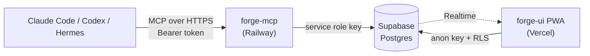

# Forge

**AI-native, Kanban-style project management for developers working with Claude Code, Codex & Hermes.**

Forge gives your coding agent a real project board. It exposes an **MCP server** so Claude Code can create tickets, move them across columns, and leave comments as it works — plus a mobile-first **React PWA** where you see all of it happen live.

The point: stop losing "I'll do that later" to chat scrollback. Your agent files it, you see it on the board.

> **Self-hosted.** You run your own Supabase project, your own MCP server, and your own web UI. There is no shared Forge service and no hosted account — this repo is the whole thing.

---

## How it works



Two write paths, one database. Your agent writes through the MCP server; you write through the web UI. Supabase Realtime pushes changes to the board, so a ticket Claude Code creates appears on your screen without a refresh.

## Features

- **7 MCP tools** — `list_projects`, `create_ticket`, `list_tickets`, `get_ticket`, `update_ticket`, `update_ticket_status`, `add_comment`
- **Live board** — drag-and-drop across `backlog → in_dev → review → done`, updating in real time
- **Automatic activity log** — every status change is recorded by a Postgres trigger, so agent moves and human moves are logged identically
- **Agent attribution** — tickets and comments record their author (`claude-code`, `codex`, `hermes`, or `human`), and agent-created tickets carry a ⚡ on the board
- **Human-readable ticket refs** — `PI-42`, `SB-7`, atomically numbered per project
- **Markdown** descriptions, acceptance criteria, and comments
- **Multi-project** with tags, priorities, and filtering
- **Installable PWA** — works offline for reading, with two themes (a clean base skin and an 8-bit "Molten Forge" skin)

## Prerequisites

- **Node.js 20+** (`.nvmrc` pins 20) and npm 10+
- A **[Supabase](https://supabase.com)** account — the free tier is plenty
- **[Claude Code](https://claude.com/claude-code)** or another MCP-capable client
- For deployment: a **[Railway](https://railway.app)** account (MCP server) and a **[Vercel](https://vercel.com)** account (web UI). Both have free tiers.

---

## Setup

### 1. Clone and install

```bash
git clone https://github.com/OndrejVatka/Forge.git
cd Forge
npm install
```

### 2. Create the Supabase project

1. Create a new project at [supabase.com/dashboard](https://supabase.com/dashboard).
2. Open [`db/schema.sql`](db/schema.sql) and change the placeholder email near the bottom to your own — it's marked with a `TODO` and seeds the access allowlist:

   ```sql
   INSERT INTO allowed_users (email, note) VALUES ('you@example.com', 'owner');
   ```

3. Paste the whole edited file into the Supabase **SQL Editor** and run it. This creates the tables, triggers, RLS policies, six default tags, and enables Realtime.
4. Go to **Project Settings → API** and copy three values:
   - **Project URL** — `https://<ref>.supabase.co`
   - **anon public key** — safe to ship in the browser bundle
   - **service_role key** — server-side only, bypasses RLS, treat it like a root password

### 3. Create your user account

Forge authenticates with email and password, and access is gated by the allowlist you seeded above. Create the matching auth account:

1. In the Supabase dashboard, go to **Authentication → Users → Add user** and create an account using **the same email** you put in `allowed_users`.
2. Then go to **Authentication → Sign In / Providers → Email** and turn **off** "Allow new users to sign up".

Step 2 is belt-and-braces: the allowlist already denies strangers everything, but there's no reason to let them create accounts at all. See [Security](#security) for how the two layers differ.

### 4. Run the web UI

```bash
cp forge-ui/.env.example forge-ui/.env
# fill in VITE_SUPABASE_URL and VITE_SUPABASE_ANON_KEY

npm run dev --workspace @forge/ui
```

Open http://localhost:5173 and sign in. Create your first project under **Settings** — you'll need a name, a slug, and a short prefix like `PI` that becomes the ticket ref.

### 5. Run the MCP server

```bash
cp forge-mcp/.env.example forge-mcp/.env
# fill in SUPABASE_URL, SUPABASE_SERVICE_ROLE_KEY, FORGE_API_KEY

npm run dev --workspace @forge/mcp
```

Generate `FORGE_API_KEY` with `openssl rand -hex 32`. It's the shared secret your agent sends as a Bearer token — there's no user identity in the MCP layer, just this key.

Each environment gets its own value. The one in `forge-mcp/.env` guards your local server only; when you deploy, Railway gets a separate key. Whichever URL an agent points at decides which key it needs.

Check it's alive:

```bash
curl -s localhost:3000/health
# {"status":"ok"}
```

### 6. Connect Claude Code

Against your local server:

```bash
claude mcp add --transport http forge http://localhost:3000/mcp \
  --header "Authorization: Bearer <FORGE_API_KEY from forge-mcp/.env>"
```

Then ask Claude Code to `list_projects`. If you get your project back, the loop is closed — try "create a ticket for the login bug" and watch it appear on the board.

---

## Deployment

### MCP server → Railway

Railway picks up [`railway.json`](railway.json) and [`nixpacks.toml`](nixpacks.toml) automatically.

1. Create a project from your GitHub repo.
2. Set `SUPABASE_URL`, `SUPABASE_SERVICE_ROLE_KEY`, and `FORGE_API_KEY` under **Variables**. Generate a **fresh** `FORGE_API_KEY` here rather than reusing your local one — production shouldn't share a secret with a file on your laptop.
3. Deploy. The healthcheck at `/health` should go green.
4. Re-point Claude Code at the deployed URL, using the key you just set in Railway:

```bash
claude mcp remove forge
claude mcp add --transport http forge https://<your-app>.up.railway.app/mcp \
  --header "Authorization: Bearer <FORGE_API_KEY from Railway Variables>"
```

> **Getting a bare `401 {"error":"Unauthorized"}`?** Almost always the local key pointed at the deployed URL, or a trailing newline picked up when copying out of the Railway dashboard. The auth middleware answers identically for every failure — by design, so it can't be used to probe for a valid key — so the response won't tell you which. Re-copy the value from Railway and check for stray whitespace.

### Web UI → Vercel

[`vercel.json`](vercel.json) has the build config; the SPA rewrite is already set up.

1. Import the repo at [vercel.com/new](https://vercel.com/new).
2. Set `VITE_SUPABASE_URL` and `VITE_SUPABASE_ANON_KEY` under **Environment Variables**.
3. Deploy.
4. Back in Supabase, add your Vercel URL under **Authentication → URL Configuration → Site URL**, or sign-in redirects will fail.

> `VITE_*` variables are inlined into the JavaScript bundle at build time. That's expected — the anon key is designed to be public, and RLS is what actually protects your data. Never put the service-role key in a `VITE_` variable.

---

## Environment variables

**`forge-mcp/.env`**

| Variable | Required | Description |
|---|---|---|
| `PORT` | no | Listen port (default `3000`) |
| `SUPABASE_URL` | yes | Your Supabase project URL |
| `SUPABASE_SERVICE_ROLE_KEY` | yes | Service-role key — server-side only, bypasses RLS |
| `FORGE_API_KEY` | yes | Shared Bearer secret your MCP client must send |

**`forge-ui/.env`**

| Variable | Required | Description |
|---|---|---|
| `VITE_SUPABASE_URL` | yes | Your Supabase project URL |
| `VITE_SUPABASE_ANON_KEY` | yes | Anon public key — safe in the browser |

Both packages validate their environment with Zod at startup and exit with a clear message if something is missing, rather than failing later with an opaque network error.

---

## Security

**Access is an explicit email allowlist.** Forge is a single-operator tool — there's no per-user ownership in the data model, so anyone with access sees the whole board. Rather than trusting "any logged-in user", every RLS policy requires the caller's email to be present in the `allowed_users` table.

This means a stranger can still register an account, but gets nothing: no allowlist row, so every read returns empty and every write is rejected. To stop account creation entirely as well, turn off signups in the dashboard (step 3 above). The allowlist is the layer that matters most, because it lives in `db/schema.sql` and therefore survives a `git clone` — dashboard settings don't.

To add someone, insert their email:

```sql
INSERT INTO allowed_users (email, note) VALUES ('teammate@example.com', 'why they need access');
```

To revoke, delete the row — it takes effect on their next request, no sign-out required.

> **Upgrading an existing install?** If your database was created before the allowlist existed, its policies still grant every authenticated user full access. Run [`db/migrations/0001_restrict_access_to_allowlist.sql`](db/migrations/0001_restrict_access_to_allowlist.sql), and read the warning at the top first.

Other things worth knowing:

- **The service-role key bypasses RLS entirely.** It belongs only in the MCP server's environment — never in the UI, never in a `VITE_` variable, never committed.
- **The MCP server has no user identity.** Anyone holding `FORGE_API_KEY` can do anything the tools allow. Generate it randomly (`openssl rand -hex 32`) and rotate it if it leaks.
- **Ticket markdown is not rendered as raw HTML** — `react-markdown` runs without `rehype-raw`, so HTML in ticket bodies is inert by design. Don't add `rehype-raw` without thinking it through.

---

## Development

### Layout

| Package | Description | Deploys to |
|---|---|---|
| [`forge-shared`](forge-shared) | Shared TypeScript domain types + Zod schemas | — (workspace lib) |
| [`forge-mcp`](forge-mcp) | Streamable HTTP MCP server (Node + Express) — [details](forge-mcp/README.md) | Railway |
| [`forge-ui`](forge-ui) | React + Vite PWA | Vercel |
| [`db`](db) | `schema.sql` — run in the Supabase SQL Editor | Supabase |
| [`design-system`](design-system) | Static HTML snapshot of the UI's visual language | — |

### Scripts

```bash
npm install                        # install all workspaces
npm run typecheck                  # tsc --noEmit across workspaces
npm run lint                       # eslint
npm run format                     # prettier --write
npm test                           # vitest run

npm run dev --workspace @forge/ui  # UI on :5173
npm run dev --workspace @forge/mcp # MCP server on :3000
```

### Conventions

- **TypeScript strict, no `any`.** Tests with Vitest, colocated with the code.
- **Fixed value sets** (status, priority, authors) live in `forge-shared` as Zod enums — one source of truth shared by server and UI, mirroring the database `CHECK` constraints.
- **Repository pattern in `forge-mcp`** — tool handlers depend on the `ForgeRepository` interface, not on Supabase directly, so they unit-test against an in-memory fake.
- **Status-change comments are written by a database trigger**, never by application code. That's what keeps the activity log identical whether a human drags a card or an agent calls `update_ticket_status`.

---

## Contributing

Issues and pull requests are welcome. Please run `npm run typecheck`, `npm run lint`, and `npm test` before opening a PR.

## License

[MIT](LICENSE) — do what you like with it, no warranty.
